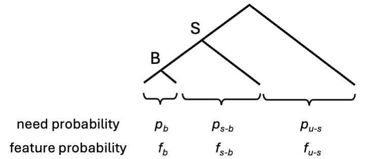

```{r, include=FALSE}
knitr::opts_chunk$set(echo = TRUE, message=FALSE, warning=FALSE)
```

```{r}
library(tidyverse)
library(here)
library(patchwork)
source("helper_functions.R", local = knitr::knit_global())
select <- dplyr::select
```

This notebook makes a plot to help understand which binary features and prior need probabilities provide more support for basic-level categories rather than superordinates according to Corter and Gluck's theory.

First set up some basic helper functions.

```{r}
# safe log
safelog <- function(p) {
  ifelse(is.na(p) | p == 0, 0, -log2(p))
}

# cross-entropy
xent <- function(p, q) {
  p * safelog(q) + (1-p) * safelog(1-q)
}

# KL divergence
error <- function(s, l) {
  xent(s, l) - xent(s, s)
}
```

We're going to focus on a single superordinate category $S$ and a single basic level category $B$ that belongs to $S$. The goal is to see which features lead to greater communicative gain for $B$ than $S$, and vice versa.

We'll consider a single feature $f$ at a time, and will compute a score `b_minus_s` that corresponds to the communicative gain for $B$ minus the communicative gain for $S$ for that feature. If `b_minus_s` is positive, then the feature supports $B$ more than $S$, and if `b_minus_s` is negative, then the feature supports $S$ more than $B$.

To compute `b_minus_s` we need six pieces of information shown in the diagram below.



$p_b$, $p_{s-b}$ and $p_{u-s}$ are need probabilities. We've set things up so that $p_b + p_{s-b} + p_{u-s} = 1$. This means that $p_{s-b}$ is the need probability for the part of $S$ that excludes $B$, and that the total need probability for $S$ is $p_b + p_{s-b}$.

$f_b$, $f_{s-b}$ and $f_{u-s}$ are feature probabilities for the corresponding regions of the tree. Again, $f_{s-b}$ is the probability that the feature takes value 1 within the part of the superordinate that excludes $B$. The probability of the feature within the superordinate will be $(p_b * f_b + p_{s-b} * f_{s-b}) / (p_b + p_{s-b})$.

If we know $p_b$ and $p_{s-b}$ we can compute $p_{u-s} = 1 - p_b - p_{s-b}$, so there are really only five degrees of freedom. We'll simplify by assuming that $f_{u-s} = 0$, which means that the feature does not occur at all outside the superordinate category. This means that we have just four parameters to consider: $p_b$, $p_{s-b}$, $f_b$ and $f_{s-b}$. 

Let's define the scoring function `b_minus_s`:

```{r}
# gain for basic minus gain for superordinate level (positive means that basic preferred)
# p_b: prob of basic level
# p_s_b: prob for the part of the superordinate that excludes the basic level category
# f_b: feature prob in basic level
# f_s_b: feature prob in part of superordinate that excludes the basic level category
# f_u_s: feature probability outside the superordinate

b_minus_s <- function(p_b, f_b, p_s_b, f_s_b,  f_u_s) {
    p_u_s <- 1 - p_b - p_s_b

    p_s <- p_b + p_s_b
    f_s <- (p_b * f_b + p_s_b * f_s_b) / p_s

    f_u <-  p_b * f_b + p_s_b * f_s_b + p_u_s * f_u_s

    gain_b <- p_b * error(f_b, f_u)
    gain_s <- p_s * error(f_s, f_u)
    
    return(gain_b - gain_s)
}
```

Now score a range of parameter values and make a plot to visualize the results.

```{r}
c_range <- c(0.01, 0.02, 0.04, 0.08, 0.16, 0.32, 0.5)
p_range <- seq(0, 1, 0.1)
po_range <- c(0)
d <- expand.grid(p_b = c_range, p_s_b = c_range, f_b = p_range, f_s_b = p_range, f_u_s = po_range)

d$b_minus_s <- mapply(b_minus_s, d$p_b, d$f_b, d$p_s_b, d$f_s_b, d$f_u_s)
```

Now we will compute average need and feature probabilities using corpus frequencies and two feature norms.

```{r}
# load feature and frequency data for Rosch
d_rosch <- read_csv(here("data", "d_rosch.csv"), show_col_types = FALSE)
rosch_id <- read_csv(here("data", "rosch_feat_id.csv"), show_col_types = FALSE)

# compute average p_b and p_s_b
p_c_rosch <- d_rosch %>%
  group_by(category, level, domain) %>%
  summarise(p_c = sum(p)) %>%
  ungroup()

p_rosch <- p_c_rosch %>%
  filter(level == "basic") %>%
  select(category, domain, p_b = p_c) %>%
  left_join(p_c_rosch %>% filter(level == "superordinate") %>%
              select(domain=category, p_s=p_c), by = "domain") %>%
  mutate(p_s_b = p_s - p_b)

mean_p_b_rosch <- mean(p_rosch$p_b)
mean_p_s_b_rosch <- mean(p_rosch$p_s_b)
  
# compute average f_b and f_s_b
all_domains <- unique(rosch_id$superordinate)

f_rosch <- map_dfr(all_domains, function(my_domain) {
  
feat_cols <- rosch_id %>% 
  filter(superordinate==my_domain) %>% 
  pull(feature_id)

f_b_rosch <- d_rosch %>%
  select(concept, category, level, domain, p, 
    any_of(feat_cols)
  ) %>%
  filter(domain == my_domain, level == "basic") %>%
  group_by(category) %>%
  summarise(across(starts_with("f_"), ~ sum(.x * p) / sum(p))) %>%
  ungroup() %>%
  pivot_longer(cols = -category, names_to = "feature", values_to = "f_b") %>%
  group_by(category) %>%
  summarise(f_b = mean(f_b)) %>%
  ungroup()

all_concepts <- d_rosch %>% 
  filter(domain == my_domain, level == "basic") %>%
  distinct(category) %>% pull()

f_s_b_rosch <- map_dfr(all_concepts, function(my_concept) {

  result <- d_rosch %>%
    select(concept, category, level, domain, p, any_of(feat_cols)) %>%
    filter(domain == my_domain, level == "basic") %>%
    filter(category != my_concept) %>%
    group_by(domain) %>%
    summarise(across(starts_with("f_"), ~ sum(.x * p) / sum(p)), .groups = "drop") %>%
    pivot_longer(cols = starts_with("f_"), names_to = "feature", values_to = "f_s_b") %>%
    group_by(domain) %>%
    summarise(f_s_b = mean(f_s_b), .groups = "drop") %>%
    mutate(category = my_concept)
})

result <- f_b_rosch %>%
  left_join(f_s_b_rosch, by = "category")
})

mean_f_b_rosch <- mean(f_rosch$f_b)
mean_f_s_b_rosch <- mean(f_rosch$f_s_b)

# load feature and frequency data for Leuven
d_leuven <- read_csv(here("data", "d_leuven.csv"), show_col_types = FALSE)
leuven_id <- read_csv(here("data", "dedeyne_feat_id.csv"), show_col_types = FALSE)

# compute average p_b and p_s_b
p_c_leuven <- d_leuven %>%
  group_by(category, level, domain) %>%
  summarise(p_c = sum(p)) %>%
  ungroup()

p_leuven <- p_c_leuven %>%
  filter(level == "terminal") %>%
  select(category, domain, p_b = p_c) %>%
  left_join(p_c_leuven %>% filter(level == "starting") %>%
              select(domain=category, p_s=p_c), by = "domain") %>%
  mutate(p_s_b = p_s - p_b)

mean_p_b_leuven <- mean(p_leuven$p_b)
mean_p_s_b_leuven <- mean(p_leuven$p_s_b)

# compute average f_b and f_s_b
all_domains <- unique(leuven_id$starting)

f_leuven <- map_dfr(all_domains, function(my_domain) {
  
feat_cols <- leuven_id %>% 
  filter(starting==my_domain) %>% 
  pull(feature_id)

f_b_leuven <- d_leuven %>%
  select(concept, category, level, domain, p, 
    any_of(feat_cols)
  ) %>%
  filter(domain == my_domain, level == "terminal") %>%
  group_by(category) %>%
  summarise(across(starts_with("f_"), ~ sum(.x * p) / sum(p))) %>%
  ungroup() %>%
  pivot_longer(cols = -category, names_to = "feature", values_to = "f_b") %>%
  group_by(category) %>%
  summarise(f_b = mean(f_b)) %>%
  ungroup()

all_concepts <- d_leuven %>% 
  filter(domain == my_domain, level == "terminal") %>%
  distinct(concept) %>% pull()

f_s_b_leuven <- map_dfr(all_concepts, function(my_concept) {

  result <- d_leuven %>%
    select(concept, category, level, domain, p, any_of(feat_cols)) %>%
    filter(concept != my_concept, category == my_domain) %>%
    group_by(category) %>%
    summarise(across(starts_with("f_"), ~ sum(.x * p) / sum(p)), .groups = "drop") %>%
    pivot_longer(cols = starts_with("f_"), names_to = "feature", values_to = "f_s_b") %>%
    group_by(category) %>%
    summarise(f_s_b = mean(f_s_b), .groups = "drop") %>%
    mutate(category = my_concept)
})

result <- f_b_leuven %>%
  left_join(f_s_b_leuven, by = "category")

})

mean_f_b_leuven <- mean(f_leuven$f_b)
mean_f_s_b_leuven <- mean(f_leuven$f_s_b)
```

Add this average probability estimates to the prediction plots:

```{r}
snap_to <- function(x, grid) grid[which.min(abs(grid - x))]

star_rosch <- tibble(
  f_b   = mean_f_b_rosch,
  f_s_b = mean_f_s_b_rosch,
  p_b   = mean_p_b_rosch,
  p_s_b = mean_p_s_b_rosch
) %>%
  mutate(
    `p[b]`   = snap_to(p_b,   c_range),
    `p[s-b]` = snap_to(p_s_b, c_range),
    which = "Rosch"
  ) %>%
  select(`p[b]`, `p[s-b]`, f_b, f_s_b, which)

star_leuven <- tibble(
  f_b   = mean_f_b_leuven,
  f_s_b = mean_f_s_b_leuven,
  p_b   = mean_p_b_leuven,
  p_s_b = mean_p_s_b_leuven
) %>%
  mutate(
    `p[b]`   = snap_to(p_b,   c_range),
    `p[s-b]` = snap_to(p_s_b, c_range),
    which = "Leuven"
  ) %>%
  select(`p[b]`, `p[s-b]`, f_b, f_s_b, which)

star_df <- bind_rows(star_rosch, star_leuven)

gain_plot1 <- plot_gradient_b_minus_s_withstar(d, star_df) + 
  theme(strip.text.y = element_blank(), strip.background.y = element_blank())
gain_plot2 <- plot_binary_b_minus_s_withstar(d, star_df) + 
  theme(axis.title.y = element_blank(), axis.text.y  = element_blank(),
        axis.ticks.y = element_blank())

gain_plot <- gain_plot1 + gain_plot2
gain_plot

ggsave(here("output/figures", "corter_gluck_model.pdf"), gain_plot, width = 17.5, height = 10, units = "cm")
```

White cells indicate parameter settings where the feature provides equal support for $S$ and $B$. Blue cells are settings that support $S$ over $B$, and red cells are settings that support $B$ over $S$.

If a data set has multiple features, then the total support for $S$ over $B$ will correspond to the sum of the `b_minus_s` scores for all features. Considering scores for individual features, however, provides some insight.

Corter and Gluck mostly consider only one superordinate at a time -- in our plot this is closest to the case where $p_b = p_{s-b} = 0.5$ (bottom right panel). There is a lot of red in this panel, indicating support for the basic level category.

It is more reasonable to think, however, that $p_b$ and $p_{s-b}$ are both substantially smaller than 0.5, which puts us in the top left part of the plot. Within this part of the plot there is more blue than red,  suggesting that there are more settings that favour $S$ than settings that support $B$.

Typically a superordinate will include multiple basic-level categories, and each of those basic-level categories will have its own set of features that are common within the category but rare outside it. For most features in a real data set, we might expect that $f_b$ is on the low side (close to zero) and that $f_{s-b}$ is higher (e.g. around 0.2 if there were five basic level categories of equal need). We therefore think that the most typical settings in each panel lie above the diagonal -- the most typical cell in each panel might be the cell where $f_b$ is 0 and $f_{s-b}$ is 0.2. These cells favour $S$ rather than $B$. These results suggest that superordinate categories will typically win according to Corter and Gluck's theory. 

The asterisk and cross represent the combinations of $p_b$, $p_{s-b}$, $f_b$ and $f_{s-b}$ that correspond to averages computed over Rosch and Leuven datasets, respectively. Both fall in the blue region, where superordinate categories are preferred over basic-level categories.
